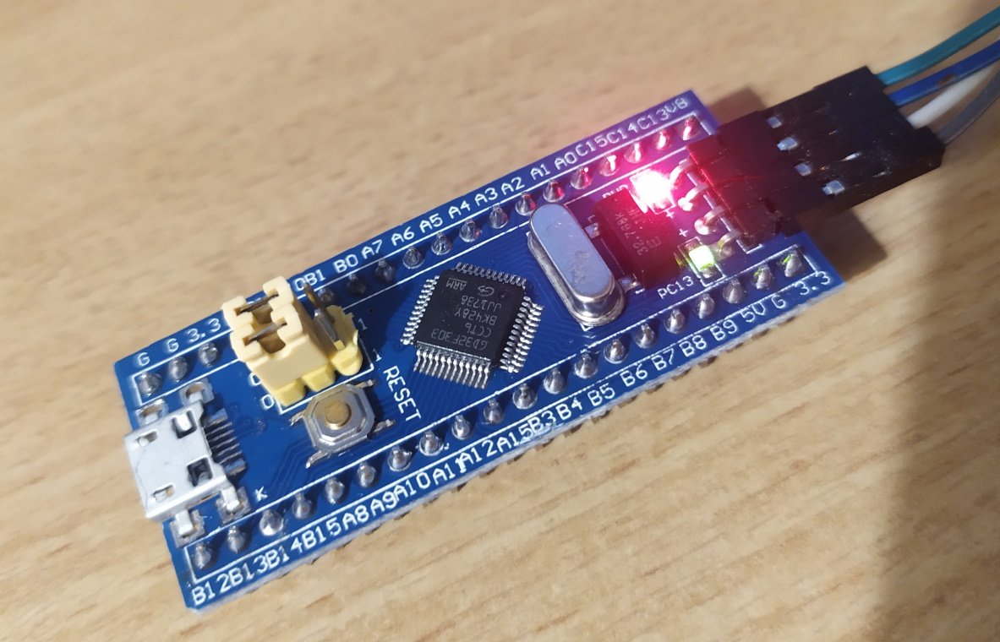

# GD32 Arduino Core (New) 

This is a Arduino core is based off of the original GigaDevice core that was provided by the company in early June 2021 (see https://github.com/CommunityGD32Cores/GD32Core/)

It is currently a work in progress, but believed to be functional on GigaDevice's mBed boards.

The intention is to further develop that original core in an open-source, community-driven manner.

## Collaborating

Interested in collaborating? Join our dedicated Discord channel for this at https://discord.gg/59kf4JxsRM.

## Media

A GD32F303CC chip (placed on a bluepill PCB) runs its first blinky code with the new Arduino core!

https://user-images.githubusercontent.com/26485477/122487271-2924d800-cfdb-11eb-8a1e-9d1ea9843e54.mp4

The same board reading out a DHT11 temperature & humidity sensor and displaying it on an SSD1306 OLED via the Adafruit GFX libraries

The board runs the Adafruit SSD1306 test sketch

https://user-images.githubusercontent.com/26485477/122623252-b0398500-d09b-11eb-9e1c-3a9f3323e403.mp4

And here it is using `analogRead()` to read the voltage over a potentiomeneter as a 12-bit value.

## Using this core with PlatformIO

Currently, development of this core is being done using PlatformIO. It uses the custom PlatformIO platform https://github.com/maxgerhardt/platform-gd32. 

Using PlatformIO is already possible to very easily edit code in the IDE and even live-debug a chip (with e.g. an ST-Link)

Example projects for this platform for the SPL framework and this Arduino core are currently hosted at https://github.com/maxgerhardt/gd32-pio-projects, but are subject to be moved soon.

## Using this core with the Arduino IDE

To compile for this core with the Arduino IDE, add the following URL to the boards manager.

`https://raw.githubusercontent.com/CommunityGD32Cores/GD32Core-New/main/package_gd32_index.json`

This will install the core and compiler toolchain against the 'main' git branch.

## Current state

The [gd32-arduino-blinky](https://github.com/maxgerhardt/gd32-pio-projects/tree/main/gd32-arduino-blinky) project compiles for the `gd32f307_mbed` board and the `genericGD32F303CC` board and works (see video above). 

Multiple more complicated demos work, like an SSD1306 OLED, analog input, `Serial`, etc. See issue https://github.com/CommunityGD32Cores/GD32Core-New/issues/8 for the latest state of tested components.

## Library compatibility list 

Legend: 
* :heavy_check_mark:  = working
* :x:  = not working at all
* :warning:  = some features not working
* :interrobang: = untested

| Name             | Works? | Notes                          |
| ---------------- |:------:| :-----------------------------:|
| Adafruit GFX     | ✔️     | Tested in conjunction with SSD1306 OLED,  CP437 symbols works |
| Adafruit SSD1306 | ✔️     | Tested on SSD1306 I2C 128x64 OLED, entire extensive demo works |

## Updates / History

_31.05.2021:_

Initial contact and thoughts about an Arduino core implementation from scratch for GD32 devices with @kemotz via Email.

_02.06.2021:_

Creation of the Github project https://github.com/maxgerhardt/gd32-arduino-core/ and a discord channel.

_10.06.2021:_

A custom dev board has been designed and is in production. The repo with the files for it is at https://github.com/kemotz/GD32F1x0-dev-brd. 

[@obra](https://github.com/obra) and [@algernon](https://github.com/algernon) join the project. 

GigaDevices is contact with a request for information on a potentially existing in-house developed Arduino core and code licensing questions.

*16.06.2021:*

GigaDeviecs confirms that there is a internally developed Arduino core, sends it over to use and approves of publishing it. The code is also BSD 3-clause licensed. 

The original files for this are found at https://github.com/CommunityGD32Cores/GD32Core.

The focus shifts from creating a new Arduino core from scratch to getting the retrieved one working and expanding upon it.

*18.06.2021:*

Arduino core:
* Add `package.json` for PlatformIO compatibility
* Add `tools\platformio\platformio-build.py` PlatformIO builder script
* gives a successful build for the gd32f307_mbed board
* gives a successful build for the genericGD32F303CC board (and gives a working blinky!)

*19.06.2021:*
* Addded a lot more demos to https://github.com/maxgerhardt/gd32-pio-projects
* Added catalog of issues for future work
* Added Arduino IDE build support, upload not yet working

## ToDo / thoughts

ToDos are now all moved to issues.

## Supported boards

*Everything is WIP now and no full support can be expected yet*.

Planned support:

*GD32F303CC based boards*

*custom GD32F190 board seen above* 

*the boards previously supported by this core, so GD32F303ZE-EVAL and GD32F307VG-MBED*

.. more?
